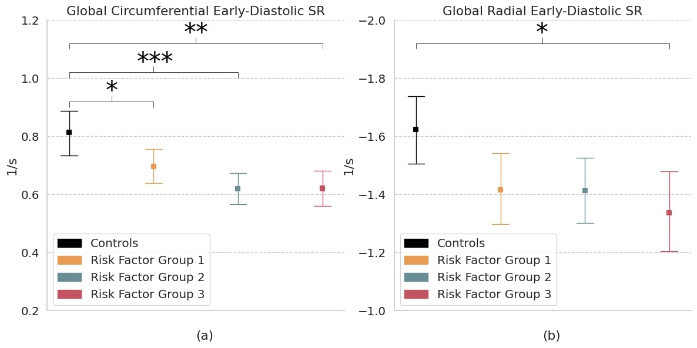

[[paper](https://www.frontiersin.org/articles/10.3389/fcvm.2021.730316/full)] [[installation](https://github.com/moralesq/DeepStrain/tree/main/installation)] [[notebooks](https://github.com/moralesq/DeepStrain/tree/main/notebooks)]

    

# DeepStrain

**DeepStrain: A Deep Learning Workflow for the Automated Characterization of Cardiac Mechanics.**  

Tensorflow implementation for cardiac segmentation, motion estimation, and strain analysis from balanced steady-state free-precession (bSSFP) cine MRI images.
**Note**: The current software works well with Tensorflow 2.3.1+.

# Evaluation

    DeepStrain Tracking in Patients Across MRI Vendors
     
    
     
    

    Short-axis bSSFP cine MRI images are shown at the mid-ventricle. To visualize tracking, myocardial contours of the endocardial (red) and epicardial (green) left ventricular wall defined at end diastole were deformed to end systole using displacement vectors based on DeepStrain. (a) 64-year-old female with prior myocardial infarction. (b) 54-year-old male with prior myocardial infarction and ventricular tachycardia. (c) 69-year-old male with prior myocardial infarction, ventricular tachycardia, and dilated cardiomyopathy. (d) 19-year-old male with hypertrophic cardiomyopathy. (a-b) Vendor 1 = 1.5T (Achieva; Philips Medical Systems, Best, the Netherlands). (c-d) Vendor 2 = 3T (MAGNETOM Vida; Siemens Healthcare, Erlangen, Germany). 
    

        
    Evaluation Relative to Feature Tracking in Patients
     
    
     
    

    Measurements of global radial and circumferential strain derived from cvi42 feature tracking were compared to those derived with DeepStrain. Each dot represents a single subject (n = 580). Solid line shows linear regression analyses based on images acquired in Philips (blue) and Siemens (red) MRI scanners. On the left, the slopes (y = 1.06×, y = 1.04×) represent a -6% and -4% disagreement in measurements of global radial strain. The slopes (y = 0.99×, y = 1.00×) on the right represent a 1% and 0% disagreement in measurements of global circumferential strain. 
    

        

#### Agreement Between cvi42 Feature Tracking and DeepStrain

| Linear Regression Slope | GRS               | GCS               | 
| ----------------------- | ----------------- | ----------------- | 
| Vendor 1 (n = 466)      | 1.06 (1.03, 1.08) | 0.98 (0.98, 1.01) |
| Vendor 2 (n = 114)      | 1.04 (0.99, 1.09) | 1.0 (0.96, 1.03)  |
| Total (n = 580)         | 1.05 (1.03, 1.08) | 0.99 (0.98, 1.01) |

| Pearson Correlation Coefficient (r) | GRS  | GCS  | 
| ----------------------------------- | ---- | -----| 
| Vendor 1 (n = 466)                  | 0.85 | 0.91 |
| Vendor 2 (n = 114)                  | 0.83 | 0.88 |
| Total (n = 580)                     | 0.85 | 0.91 |

GRC = global radial strain; GCS = global circumferential strain. 
Vendor 1 = 1.5T (Achieva; Philips Medical Systems, Best, the Netherlands); Vendor 2 = 3T (MAGNETOM Vida; Siemens Healthcare, Erlangen, Germany).
Data are the slope (95% confidence interval of the slope) and Pearson correlation coefficient (r).

# Application

    
     
    

    The study cohort consisted of 119 participants (35 ± 5 years, 50% male) including the control group with 30 subjects; RFG1 with 39 overweight subjects; RFG2 with 30 hypertensive subjects, including 13 (43%) with additional overweight; RFG3 with 20 T2DM subjects, including 11 (55%) with additional overweight, 1 (5%) with additional hypertension and 8 (40%) with both. Measures of (a) circumferential and (b) radial early-diastolic strain rate (SR) in controls and risk factor groups. Strain results are visualized as mean with 95% confidence interval. Post-hoc test by Bonferroni: * p < 0.05; ** p < 0.01; *** p < 0.001. RFG = risk factor group.
    

        

## Publications

If you find DeepStrain or some part of the code useful, please cite as appropiate:

- **DeepStrain: A Deep Learning Workflow for the Automated Characterization of Cardiac Mechanics.** [Manuel A. Morales](https://catanalab.martinos.org/lab-members/manuel-a-morales/), [Maaike van den Boomen](https://nguyenlab.mgh.harvard.edu/maaike-van-den-boomen-ms/), [Christopher Nguyen](https://nguyenlab.mgh.harvard.edu/christopher-nguyen-phd-2/), [Jayashree Kalpathy-Cramer](https://www.ccds.io/leadership-team/jayashree-kalpathy-cramer/), [Bruce R. Rosen](https://www.martinos.org/investigator/bruce-rosen/), [Collin M. Stultz](https://mitibmwatsonailab.mit.edu/people/collin-m-stultz/), [David Izquierdo-Garcia](https://catanalab.martinos.org/lab-members/david-izquierdo-garcia/),  [Ciprian Catana](https://catanalab.martinos.org/lab-members/ciprian-catana/). Frontiers in Cardiovascular Medicine, 2021. DOI: https://doi.org/10.3389/fcvm.2021.730316.

- **DeepStrain Evidence of Asymptomatic Left Ventricular Diastolic and Systolic Dysfunction in Young Adults With Cardiac Risk Factors.** [Manuel A. Morales](https://catanalab.martinos.org/lab-members/manuel-a-morales/), Gert J. H. Snel, [Maaike van den Boomen](https://nguyenlab.mgh.harvard.edu/maaike-van-den-boomen-ms/), Ronald J. H. Borra, Vincent M. van Deursen, Riemer H. J. A. Slart, [David Izquierdo-Garcia](https://catanalab.martinos.org/lab-members/david-izquierdo-garcia/), Niek H. J. Prakken,  [Ciprian Catana](https://catanalab.martinos.org/lab-members/ciprian-catana/). Frontiers in Cardiovascular Medicine, 2022. DOI: https://doi.org/10.3389/fcvm.2022.831080

- **Comparison of DeepStrain and Feature Tracking for Cardiac MRI Strain Analysis.** [Manuel A. Morales](https://cardiacmr.hms.harvard.edu/people/manuel-morales-phd), [Julia Cirillo](https://cardiacmr.hms.harvard.edu/people/julia-cirillo), [Kei Nakata](https://cardiacmr.hms.harvard.edu/people/kei-nakata-md-phd), [Selcuk Kucukseymen](https://cardiacmr.hms.harvard.edu/people/selcuk-kucukseymen-md), [Long H. Ngo](https://www.bidmc.org/research/research-by-department/medicine/general-medicine-research/research-faculty/long-h-ngo-phd), [David Izquierdo-Garcia](https://catanalab.martinos.org/lab-members/david-izquierdo-garcia/),  [Ciprian Catana](https://catanalab.martinos.org/lab-members/ciprian-catana/), [Reza Nezafat](https://cardiacmr.hms.harvard.edu/people/reza-nezafat). Journal of Magnetic Resonance Imaging, 2022. DOI:
