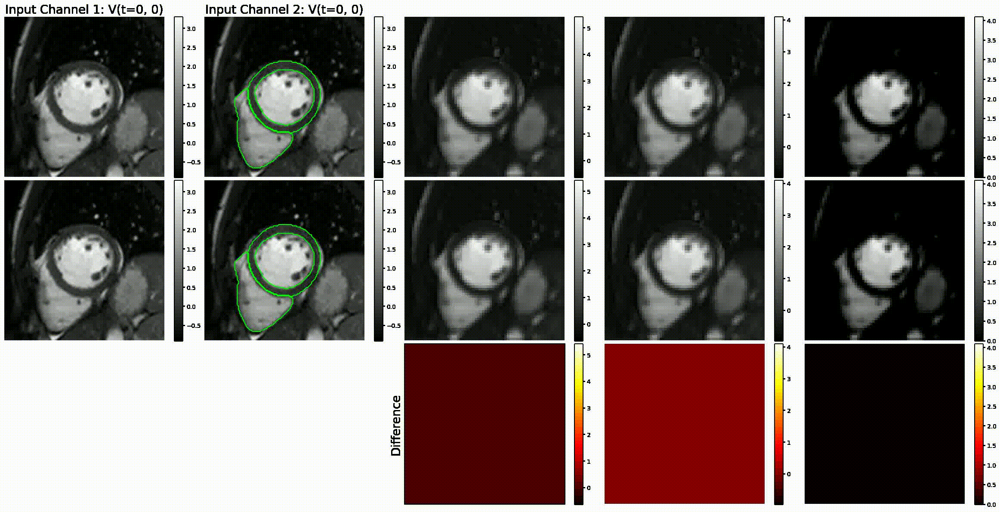

# DeepStrain Features
[Paper](https://www.frontiersin.org/articles/10.3389/fcvm.2021.730316/full)
    
Let Ck denote a Convolution-BatchNorm-PReLU layer with k filters. CDk denotes a Upsampling-Convolution-BatchNorm-PReLU layer with upsampling applied using nearest-neighbor interpolation of stride 2x2x2. Unless specified, all convolutions are 3x3x3 spatial filters applied with 1x1x1 stride. An encoding layer Ek consists of a Ck layer followed by a second Ck layer with stride 2x2x2. A third Ck layer follows but without BatchNorm-PReLU. The output is the residual connection made by element-wise addition of the second Ck layer before BatchNorm-PReLU are applied, and the third Ck layer. A decoding layer Dk consists of a Ck layer with (1x1x1)-sized filters followed by CDk and Ck layers. Thus, the 2x2x2 strided convolution in Ek downsamples by a factor of 2, whereas the upsampling operation with stride 2x2x2 in Dk upsamples by a factor of 2 With this notation, the encoder-decoder architecture common to all three networks consists of 
encoder: E64-E128-E256-E512-E512-E512-E512. decoder: D512-D512-D512-D256-D128-D64.

## ENCODER E64

Below we visualize the features extracted by the first enconder: 

### Conv Layer 1 

The first Conv layer consists of a convolution-batchnorm-prelu operations. Below we visualize the output of each when the inputs are [V(t=0), V(t=0)] (row 1) and [V(t=0), V(t=10)] (row 2). The third row shows the difference between the first and the second rows. The video loops across various extracted features (i.e., channel dimension). Notice (1) that prelu layer output does not have negative values, (2) that the main differences between the rows are located in regions where myocaridum deforms.  

  

    

   
The video below loops instead across various time frames while maintaining the channel constant. 

 
### Conv Layer 2

This is equivalent as Conv layer 1. 

    

### Conv Layer 3

