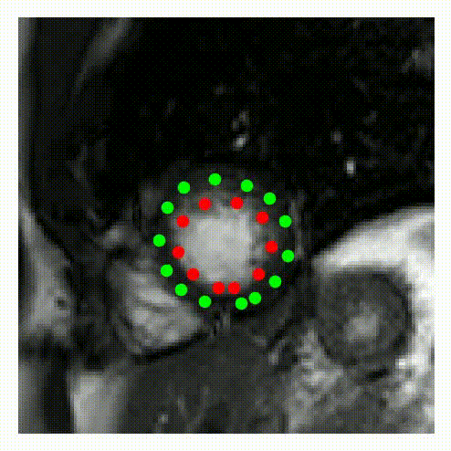
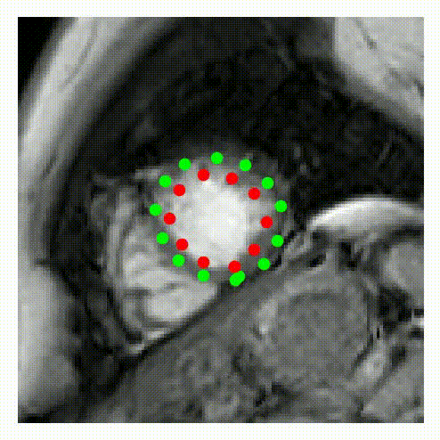
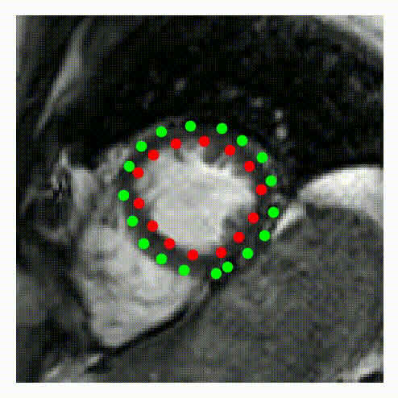
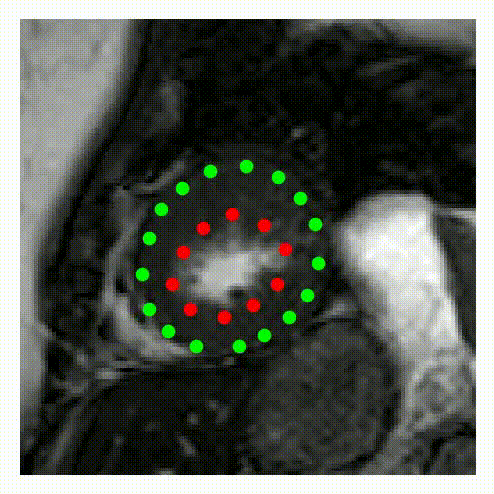
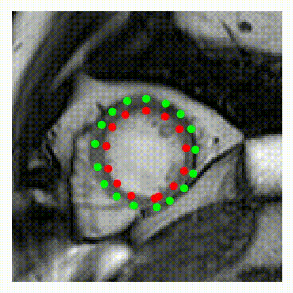
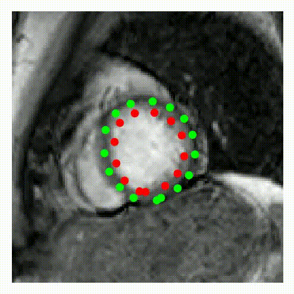

# DeepStrain
[Paper](https://www.frontiersin.org/articles/10.3389/fcvm.2021.730316/full)

### Apical Deformation in seven healthy subjects 

Displacement vectors per-pixel were derived using the cine images only, i.e., without myocardial contours.

To visualize the vectors, endocardial and epicardial myocardial contours were drawn. 

Each point in the contour was then deformed according to the predicted displacement vector. 

The videos below show the "tracked" deformation near the apical slices. 

  
  
  
  

  
  
  

